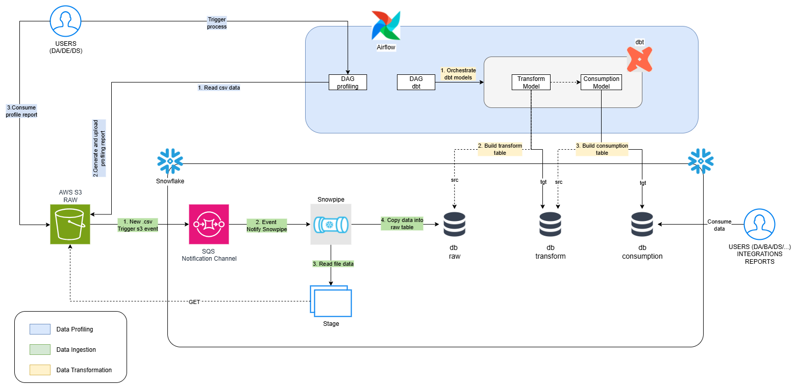

# Data Engineer Challenge - Novicap

This repository contains Sebastian's proposed solution to the data engineer challenge.

## Overview

This is the high level architecture design of the solution, each step in the process will be explained in the following sections below.

## Data Engineering Lifecycle

* [Data Profiling/Data Insights](eda/data_profiling.ipynb)
* [Data Ingestion](docs/Data%20Ingestion.md)
* [Data Transformation/Consumption](docs/Data%20Transformation.md)

Author: @svargasg [Sebastian Vargas Gantiva]
