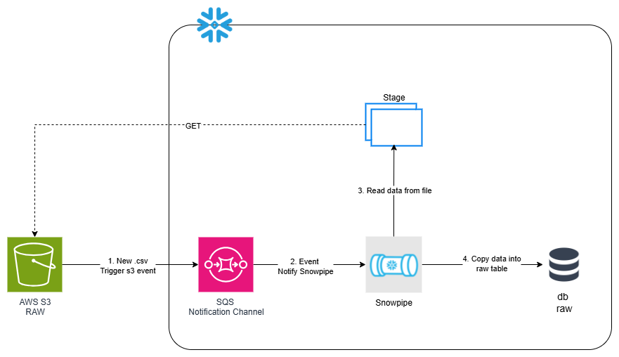
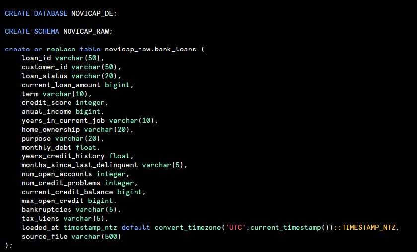
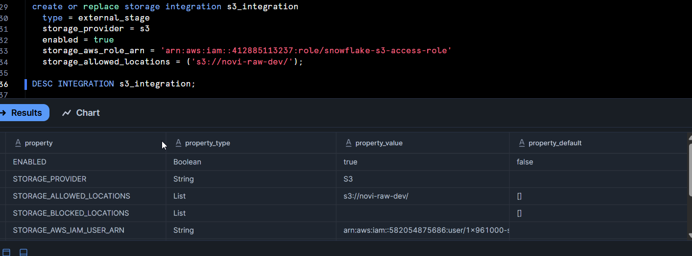
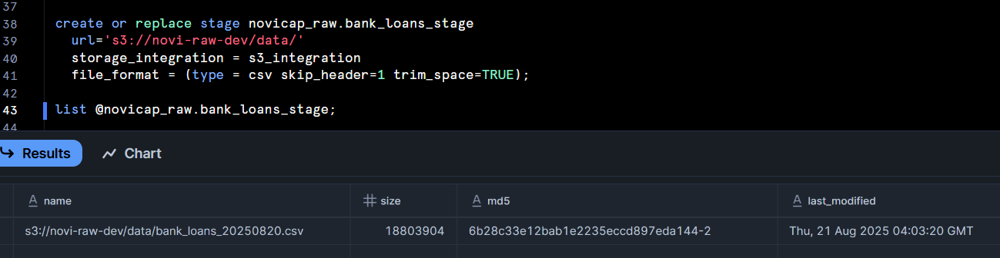
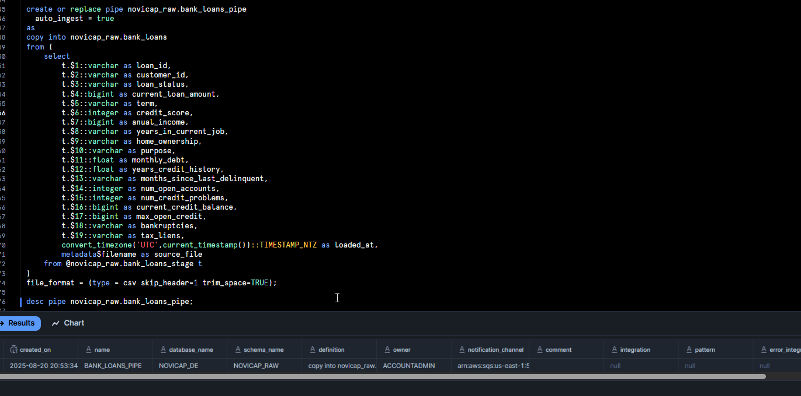
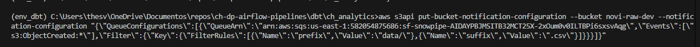
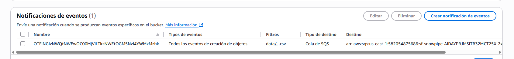
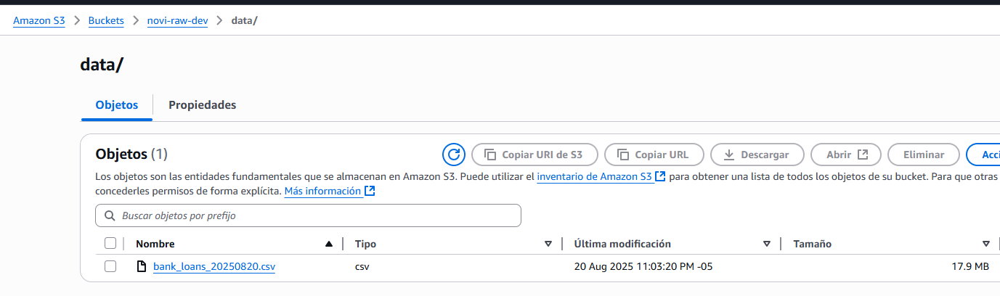
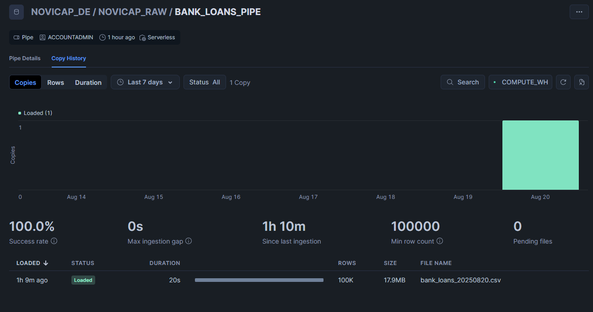
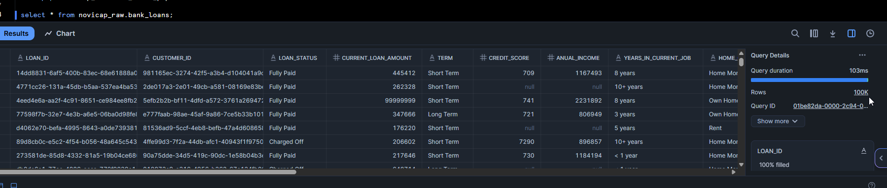

# Data Ingestion

In order to ingest data into the cloud based on the .csv data files, the following workflow was designed:

## Considerations

- Raw files are stored in AWS S3 (object storage)
- We are using Snowflake as our cloud data warehouse because of its scalability, good performance, and elastic architecture. It does not require complex operational overhead for administration and maintenance, and it also has high integration with BI, ETL, and ML tools.
- We assume that if we receive new files, they will be in the same csv format (order and structure). Otherwise, it will be necessary to implement an intermediate step to standardize the files to a more versatile format such as Parquet, which is a column-oriented, compressed, and schema-evolving format that is a goot fit for analytics purposes (OLAP).

## Architecture

- Since we are using Snowpipe to load the data, the load has a micro-batch pattern (near real time) and event based (Every time we receive a file, it is treated as an event.)
- At this stage, there is no duplicate handling; insertion is in append mode.
- We store the data exactly as we receive it (RAW layer)

## Implementation

Scripts are attached in [sf_initialize_objects.sql](./sf_initialize_objects.sql)

1. Create database, raw schema and raw table structure based on the data profiling to identify the correct data types and also we add some metadata columns for audit purposes.

2. Create snowflake [storage integration](https://docs.snowflake.com/en/user-guide/data-load-s3-config-storage-integration) to link with AWS s3 (ensure that you have a IAM Role with enough permissions to s3 where you will receive data)

3. Create stage object to link an specific aws s3 files data

4. Create Snowpipe to auto ingest .csv files into raw table

5. Configure the event notification from s3 to sqs

6. Upload a .csv in the folder and validate the snowpipe works as expected

**All the previous deploy steps could be done via terraform but due to time limitations, they are out of scope for this test.**

**Due to time limitations, observability mechanisms (error notifications and alerts) are out of scope for this test.**

Author: @svargasg [Sebastian Vargas Gantiva]

    <a href="../README.md"><< README </a>

    <a href="../data_ingestion/Data Ingestion.md">Data Ingestion >></a>

