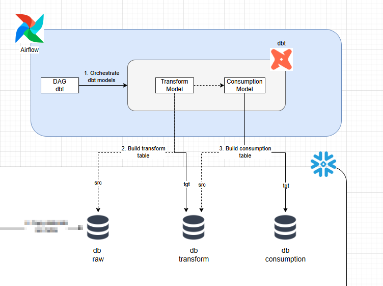
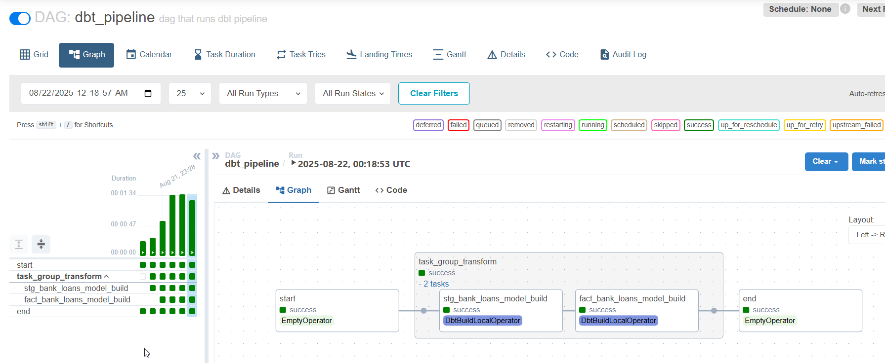
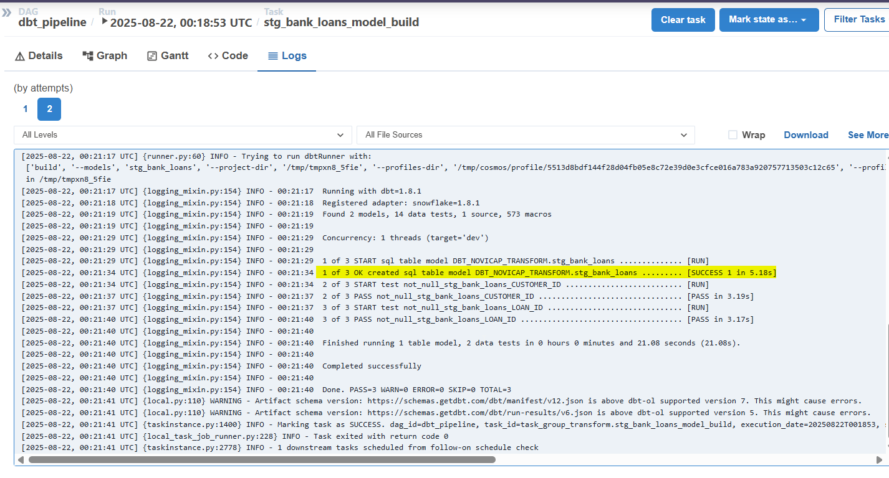
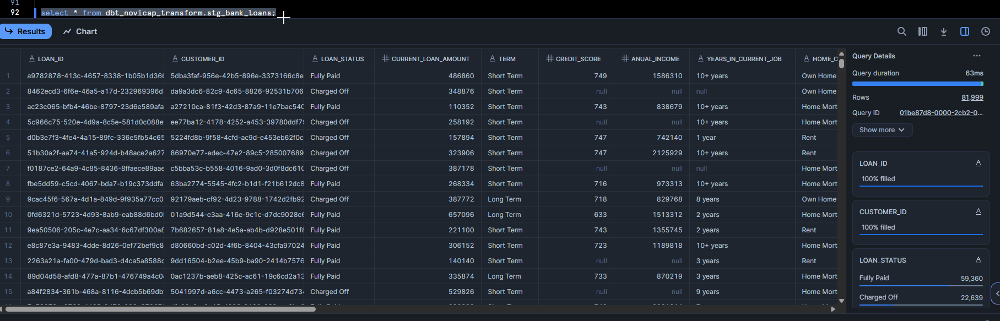
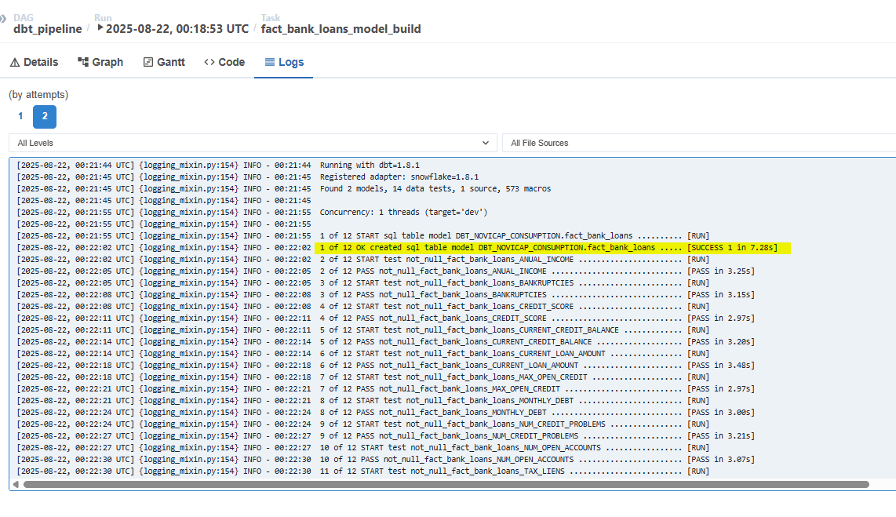
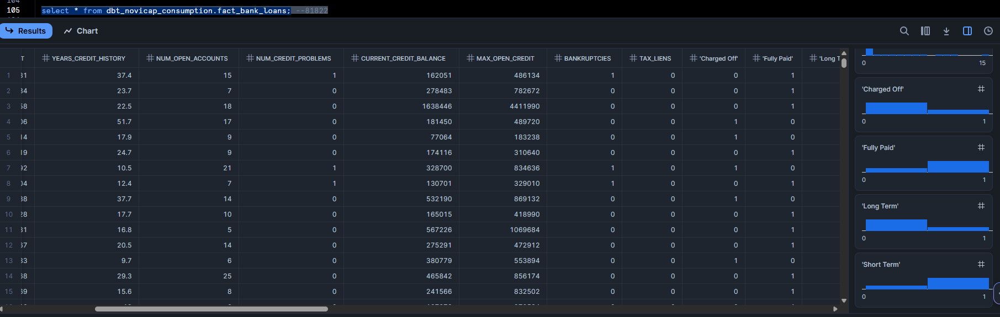

# Data Transformation & Consumption

In order to transform data in the cloud based on the raw data previously ingested, the following workflow was designed:

## Considerations

- The source data is the data that was previously ingested.
- We continue to use Snowflake as our cloud data platform.
- Airflow is currently deployed locally under the open source Astronomer distribution due to its ease of deployment and administration. It could be deployed on EC2 or Astronomer Cloud.
- Dbt is deployed containerized in Docker within Airflow, using the dbt Core distribution with the dbt connector to Snowflake. This allows for an isolated environment that is easy to deploy. Dbt is a very powerfull tool to execute sql commands, macros, testing and document data models.
- To generate DAGs that orchestrate DBT models (run + test) instead of using BatchOperators (which are more complex to manage in terms of initialization, configuration, and generate dependencies), we use the [Astronomer Cosmos](https://astronomer.github.io/astronomer-cosmos/getting_started/index.html) open source library, which internally manages and orchestrate dbt workflows easily.

## Architecture

- Since we are using Airflow to orchestrate, the architecture pattern, it is in batch mode, based on a cron schedule (or, if desired, a trigger could be generated from the Airflow API after data is loaded in raw layer).
- Now we have two more layers: **TRANSFORM**, which contains a clean and standardized data model (deduplication, data formatting, among other light transformations), and **CONSUMPTION**, which contains an enriched and intelligent data model (complex calculations, joins, fact/dims modeling, among others) for analytical purposes.

## Implementation

### Requirements
- Configure the connection profile between dbt and Snowflake correctly.
    - Airflow generic connection poiting to snowflake account must be configured.
- Dbt project config and Dbt execution config must be configured correctly.

A dag called [dbt_pipeline.py](../dags/dbt_pipeline.py) was created to orchestrate the execution of the dbt models (transform and consumption) to execute the run (load data) and test (unit testing). The performance is quite good, as it takes less than 2 minutes to run the entire process.

### Transform layer

0. Define all the sources needed in [_raw.yml](../dags/dbt/novicap/models/raw/_raw.yml)

1. The SQL logic for the data model in transform was created in the file [stg_bank_loan.sql](../dags/dbt/novicap/models/transform/stg_bank_loans.sql)
    
    - In the raw data, we have completely duplicate rows, which we delete in this step.
    - We converted some NA and N/A values in some columns to null.
    - We group together certain homogeneous categorical values to avoid redundancy.
    - We adjusted the data type for some columns.
    - We created a data completeness metric because after removing duplicate records, there is more than one record associated with the same loan_id and customer_id. The difference is that some of the records have more complete data than others. This completeness metric allows us to identify the best record by load_id and customer_id.

The resulting physical model is as follows

| name                          | type                |
|-------------------------------|---------------------|
| LOAN_ID                       | VARCHAR(50)         |
| CUSTOMER_ID                   | VARCHAR(50)         |
| LOAN_STATUS                   | VARCHAR(20)         |
| CURRENT_LOAN_AMOUNT           | NUMBER(38,0)        |
| TERM                          | VARCHAR(10)         |
| CREDIT_SCORE                  | NUMBER(38,0)        |
| ANUAL_INCOME                  | NUMBER(38,0)        |
| YEARS_IN_CURRENT_JOB          | VARCHAR(10)         |
| HOME_OWNERSHIP                | VARCHAR(20)         |
| PURPOSE                       | VARCHAR(16777216)   |
| MONTHLY_DEBT                  | FLOAT               |
| YEARS_CREDIT_HISTORY          | FLOAT               |
| MONTHS_SINCE_LAST_DELINQUENT  | NUMBER(38,0)        |
| NUM_OPEN_ACCOUNTS             | NUMBER(38,0)        |
| NUM_CREDIT_PROBLEMS           | NUMBER(38,0)        |
| CURRENT_CREDIT_BALANCE        | NUMBER(38,0)        |
| MAX_OPEN_CREDIT               | NUMBER(38,0)        |
| BANKRUPTCIES                  | NUMBER(38,0)        |
| TAX_LIENS                     | NUMBER(38,0)        |
| LOADED_AT                     | TIMESTAMP_NTZ(9)    |
| SOURCE_FILE                   | VARCHAR(500)        |
| COMPLETENESS_SCORE            | NUMBER(19,0)        |
| LOADED_AT_TRANS               | TIMESTAMP_NTZ(9)    |

2. Document transform data model in [_transform.yml](../dags/dbt/novicap/models/transform/_transform.yml)

    * Note: Due to time constraints, not all unit tests on the columns were defined to measure the quality of the resulting data.

3. The execution of the DBT model looks something like the following from the log in Airflow.

4. A preview of the data in Snowflake looks like this (As you can see, we went from 100k records to 82k)

### Consumption layer

1. The SQL logic for the data model in consumption was created in the file [fact_bank_loans.sql](../dags/dbt/novicap/models/consumption/fact_bank_loans.sql), assuming that the purpose of this dataset is for training and/or predicting an ML model, feature engineering is applied according to the following:

    - Id columns were removed.
    - Columns with more than 50% of data with null were removed (months_since_last_delinquent).
    - Some few rows (hundreds that represent less than 5% of data) with nulls for max_open_credit, bankruptcies, tax_liens were removed.
    - Imputation of null values based on the most frequently occurring value (categorical) and/or average (numerical), partitioning by categorical variables to perform a better imputation. If null values still persist, the global average and most frequent value is taken.
    - Using one-hot encoding for categorical variables dynamically.

The resulting physical model is as follows

| name                   | type         |
|------------------------|--------------|
| CURRENT_LOAN_AMOUNT    | NUMBER(38,0) |
| CREDIT_SCORE           | NUMBER(38,0) |
| ANUAL_INCOME           | NUMBER(38,0) |
| MONTHLY_DEBT           | FLOAT        |
| YEARS_CREDIT_HISTORY   | FLOAT        |
| NUM_OPEN_ACCOUNTS      | NUMBER(38,0) |
| NUM_CREDIT_PROBLEMS    | NUMBER(38,0) |
| CURRENT_CREDIT_BALANCE | NUMBER(38,0) |
| MAX_OPEN_CREDIT        | NUMBER(38,0) |
| BANKRUPTCIES           | NUMBER(38,0) |
| TAX_LIENS              | NUMBER(38,0) |
| 'Charged Off'          | NUMBER(1,0)  |
| 'Fully Paid'           | NUMBER(1,0)  |
| 'Long Term'            | NUMBER(1,0)  |
| 'Short Term'           | NUMBER(1,0)  |
| '1 year'               | NUMBER(1,0)  |
| '10+ years'            | NUMBER(1,0)  |
| '2 years'              | NUMBER(1,0)  |
| '3 years'              | NUMBER(1,0)  |
| '4 years'              | NUMBER(1,0)  |
| '5 years'              | NUMBER(1,0)  |
| '6 years'              | NUMBER(1,0)  |
| '7 years'              | NUMBER(1,0)  |
| '8 years'              | NUMBER(1,0)  |
| '9 years'              | NUMBER(1,0)  |
| '< 1 year'             | NUMBER(1,0)  |
| 'Home Mortgage'        | NUMBER(1,0)  |
| 'Own Home'             | NUMBER(1,0)  |
| 'Rent'                 | NUMBER(1,0)  |
| 'Business Loan'        | NUMBER(1,0)  |
| 'Buy A Car'            | NUMBER(1,0)  |
| 'Buy House'            | NUMBER(1,0)  |
| 'Debt Consolidation'   | NUMBER(1,0)  |
| 'Educational Expenses' | NUMBER(1,0)  |
| 'Home Improvements'    | NUMBER(1,0)  |
| 'Major Purchase'       | NUMBER(1,0)  |
| 'Medical Bills'        | NUMBER(1,0)  |
| 'Moving'               | NUMBER(1,0)  |
| 'Other'                | NUMBER(1,0)  |
| 'Renewable Energy'     | NUMBER(1,0)  |
| 'Small Business'       | NUMBER(1,0)  |
| 'Take A Trip'          | NUMBER(1,0)  |
| 'Vacation'             | NUMBER(1,0)  |
| 'Wedding'              | NUMBER(1,0)  |

2. Document transform data model in [_consumption.yml](../dags/dbt/novicap/models/consumption/_consumption.yml)

    * Note: Due to time constraints, not all unit tests on the columns were defined to measure the quality of the resulting data.

3. The execution of the DBT model looks something like the following from the log in Airflow.

4. A preview of the data in Snowflake looks like this

5. This dataset could be exposed through an API in Snowflake or simply consumed through ODBC/JDBC connectors for use by external integrations.

* Note: If standardized data models (dimensional modeling or OBT) need to be generated, the necessary entities supported according to the use case (probably descriptive analytics and reporting) could be identified and generated in new dbt models.

**Due to time limitations, incremental load strategy in transform/consumption is out of scope for this test.**
**Due to time limitations, observability mechanisms (error notifications and alerts) are out of scope for this test.**

Author: @svargasg [Sebastian Vargas Gantiva]

    <a href="../docs/Data Ingestion.md"><< Data Ingestion</a>

    <a href="../README.md">README >></a>

